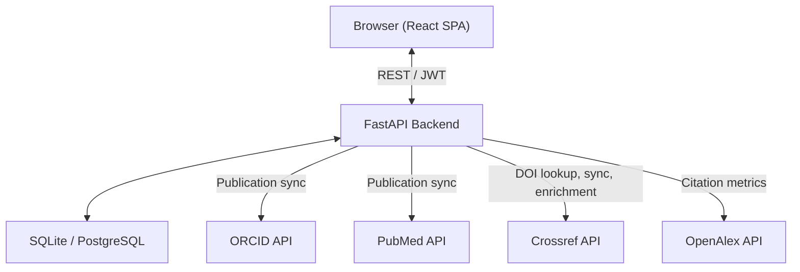
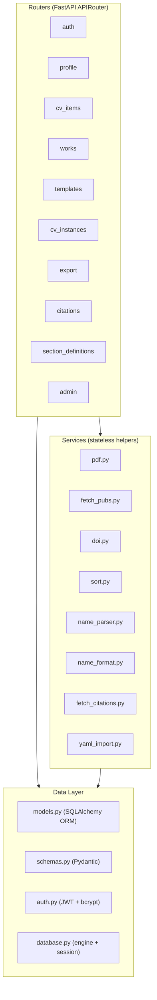
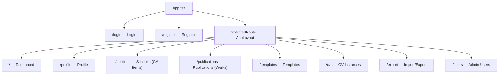
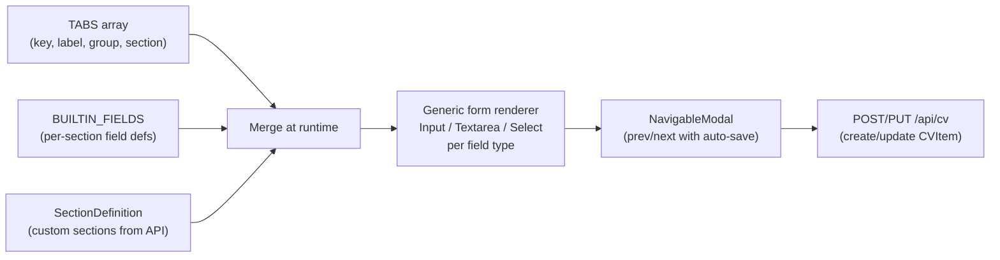

# Component Architecture

> For procedural instructions (adding sections, schema changes), see [CLAUDE.md](../../CLAUDE.md).
> For table structures, see [database-schema.md](database-schema.md). For data flows, see [data-flows.md](data-flows.md).

## System Overview

## Backend Layers

### Router Responsibilities

| Router | Prefix | Manages |
|--------|--------|---------|
| auth | `/api/auth` | Register, login, password change, current user |
| profile | `/api` | Profile CRUD (name, contact, addresses, identifiers) |
| cv_items | `/api/cv` | CRUD for all CVItem-backed sections |
| works | `/api/works` | CRUD for scholarly works, DOI lookup, sync, enrichment |
| templates | `/api/templates` | Template CRUD, copy, preview, PDF export, definition import/export |
| cv_instances | `/api/cv-instances` | Instance CRUD, section overrides, item curation, preview/PDF |
| export | `/api/export` | Full YAML backup and restore |
| citations | `/api/citations` | Fetch/summarize citation metrics from OpenAlex |
| section_definitions | `/api/section-definitions` | Custom section type CRUD |
| admin | `/api/admin` | User management (requires is_admin) |

### Authentication

- JWT (HS256) with configurable expiry (default 24h)
- Passwords hashed with bcrypt
- Per-IP rate limiting on `/register` and `/login` (10 attempts / 60s)
- Dependencies: `get_current_user()`, `get_current_admin()`, `get_optional_current_user()`

## Frontend Pages & Routing

### Three Frontend Data Patterns

**1. TABS/FIELDS-driven forms** (`Sections.tsx`)
- Declarative configuration drives a generic form renderer
- `TABS` array defines available sections (key, label, group, API section)
- `BUILTIN_FIELDS` record defines form fields per section (key, label, type, options)
- Custom `SectionDefinition`s fetched from API extend both at runtime
- Supports search, copy, delete, and NavigableModal for editing

**2. Direct API pages** (`Profile.tsx`, `Publications.tsx`)
- Page-specific forms with `useQuery` / `useMutation` (TanStack React Query)
- Publications has rich features: DOI lookup, sync candidates, complete-fields diff review, author name parsing, citation preview, work type filtering

**3. Composer pattern** (`Templates.tsx`, `CVInstances.tsx`)
- Drag-and-drop section ordering via `@dnd-kit`
- `SectionComposer` component shared between both pages
- Templates define style + sections; instances add overrides + curation
- Style editing with 20+ properties and theme presets

## Dynamic Form System

**Field types supported:**
- `text` (default) — standard input
- `number` — numeric input
- `textarea` — multi-line text
- `options` — select dropdown (e.g., trainee_type, grant_type, status)
- `list` — JSON array with add/remove UI (e.g., press outlets)

**Tab features:**
- `section` can be comma-separated to fetch from multiple sections (e.g., `"trainees_advisees,trainees_postdocs"`)
- `subtypeField` — form field that determines which section to create in (e.g., trainee_type → section)
- Groups: "Education & Experience", "Teaching & Mentorship", "Grants", "Service", "Other", "Custom Sections"

## Shared Components

All in `components/ui.tsx` — Tailwind-based, no external component library:

| Component | Purpose |
|-----------|---------|
| `Button` | Variants: primary, secondary, danger, ghost. Sizes: sm, md, lg. Loading state. |
| `Input` | Labeled text input with error display |
| `Textarea` | Labeled multi-line input |
| `Select` | Labeled dropdown with `{value, label}[]` options |
| `Modal` | Overlay dialog with title and close |
| `NavigableModal` | Modal with prev/next arrow navigation + auto-save |
| `Card` | Content container |
| `PageHeader` | Title + subtitle + action buttons |
| `Badge` | Colored label (blue, green, yellow, red, gray, purple) |
| `Spinner` | Loading indicator |
| `Checkbox` | Labeled checkbox |

### Cross-cutting components

| Component | Used by |
|-----------|---------|
| `SectionComposer` | Templates.tsx, CVInstances.tsx — drag-and-drop section ordering |
| `SectionPickerModal` | SectionComposer — grouped section selector with multi-select |
| `ProtectedRoute` | App.tsx — auth guard wrapping all non-login routes |
| `Layout` (AppLayout) | App.tsx — sidebar navigation + main content area |
| `AuthProvider` | App.tsx — global auth context (token in localStorage, auto-load user) |

### State Management

- **TanStack React Query** for server state (staleTime: 30s, retry: 1)
- **React Context** for auth state only (`AuthProvider`)
- **Local state** for form data, modals, and UI toggles
- Cache invalidation after mutations via `queryClient.invalidateQueries()`
