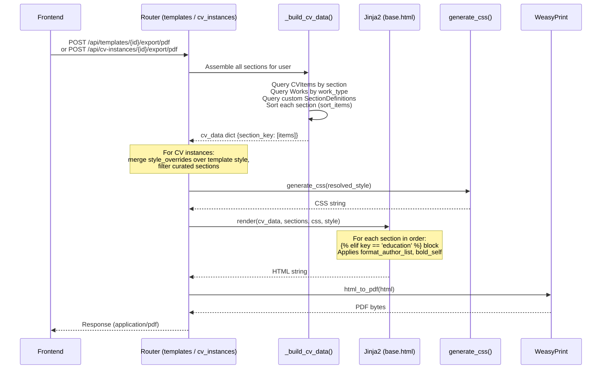
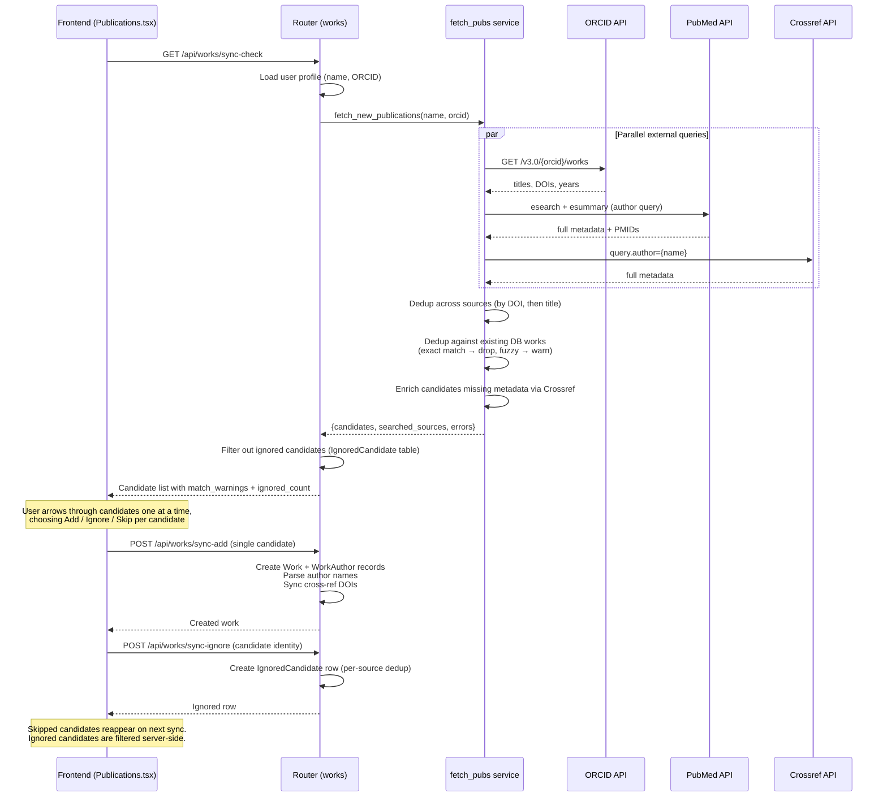
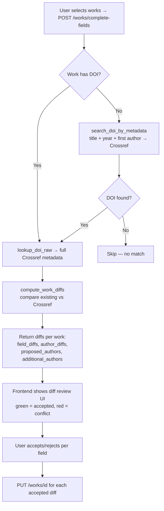
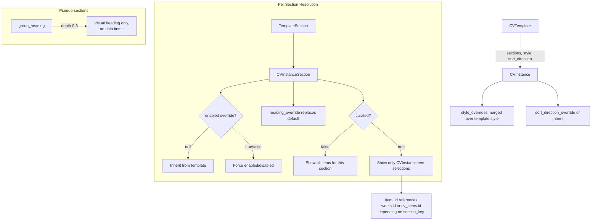
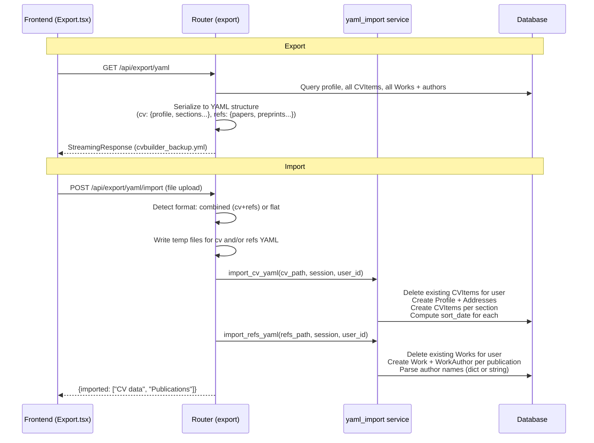

# Data Flows

> For procedural instructions (adding sections, schema changes), see [CLAUDE.md](../../CLAUDE.md).
> For table structures and section key mappings, see [database-schema.md](database-schema.md).

## 1. PDF Generation

The most complex data flow — assembles all CV data, renders HTML via Jinja2, and converts to PDF.

**Key files:**
- `routers/templates.py` — `_build_cv_data()`, template preview/export endpoints
- `routers/cv_instances.py` — `_build_cv_instance_data()`, instance preview/export endpoints
- `services/pdf.py` — `generate_css()`, `render_cv_html()`, `html_to_pdf()`
- `cv_templates/base.html` — Jinja2 template with per-section rendering blocks

**Style resolution:** Template `style` dict → merged with instance `style_overrides` → passed to `generate_css()` which maps properties to CSS classes (`.cv-page`, `.cv-header`, `.cv-section`, `.pub-entry`, etc.).

## 2. Publication Sync

Discovers new publications from external APIs and presents candidates for user review.

**Key files:**
- `services/fetch_pubs.py` — `fetch_new_publications()`, per-source fetchers, deduplication
- `routers/works.py` — `/sync-check`, `/sync-add`, `/sync-ignore`, `/sync-ignored` endpoints
- `models.py` — `IgnoredCandidate` model for persistent ignore
- `services/name_parser.py` — `parse_author_name()` for structured name extraction

**Author matching:** PubMed and Crossref results are filtered to only include works where the user appears as author. Matching checks: last name (whole word) + first initial + middle initial guard.

**Dedup logic:** Exact matches by DOI or normalized title+year are dropped. Fuzzy matches (title similarity ≥ 0.75 + year within 2 years or year unknown) are kept but flagged with warnings. Cross-ref DOIs (preprint ↔ published) are auto-linked.

**Ignore logic:** Ignored candidates are stored per-source in the `ignored_candidates` table. Identity matching is source-specific: PubMed uses PMID, Crossref uses DOI, ORCID uses DOI (or normalized title+year as fallback). Ignored candidates are filtered from `sync-check` results server-side. Users can manage (list/un-ignore) via `GET /sync-ignored` and `DELETE /sync-ignored/{id}`.

## 3. DOI Enrichment & Complete Fields

Fills in missing metadata for existing works using Crossref.

**Key files:**
- `services/doi.py` — `lookup_doi()`, `search_doi_by_metadata()`, `compute_work_diffs()`
- `routers/works.py` — `/complete-fields` endpoint (read-only), `/enrich-authors` and `/enrich-authors-bulk`

**DOI discovery thresholds:** Title similarity ≥ 0.80 + ≥2 corroborating signals (year, first author, journal), OR title similarity ≥ 0.95 standalone. Similarity uses max(Jaccard, overlap coefficient) on normalized word sets.

## 4. CV Instance Curation

CV instances inherit from templates but allow per-section overrides and item curation.

**Key files:**
- `routers/cv_instances.py` — CRUD, section management, `_build_cv_instance_data()`
- `routers/cv_instances.py:SECTION_KEY_MAP` — determines which table to query per section_key

**Curation flow:** When `curated=True` on a section, only items whose IDs appear in `cv_instance_items` are rendered. The frontend provides a checklist UI via `GET /cv-instances/{id}/sections/{key}/items` (returns items with `selected` flag) and `PUT .../items` to save selections.

## 5. YAML Import/Export

Full backup and restore of CV data.

**Key files:**
- `routers/export.py` — `/yaml` export, `/yaml/import` import
- `services/yaml_import.py` — `import_cv_yaml()`, `import_refs_yaml()`, `_author_fields()` for name parsing

**Import is destructive:** Deletes all existing CVItems and Works for the user before importing. The YAML format supports structured author dicts (`{name, family, given, suffix}`) or plain strings.
