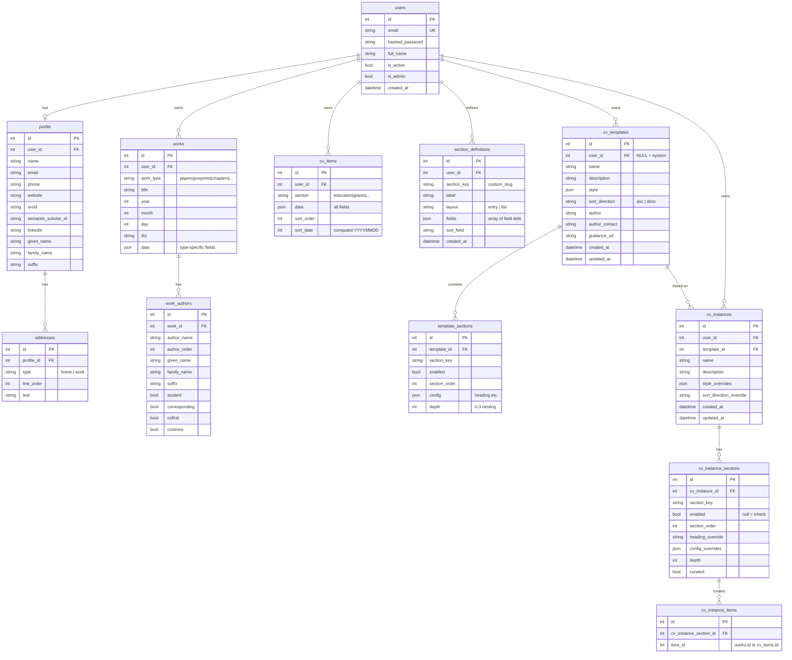

# Database Schema

> For procedural instructions (adding sections, schema changes), see [CLAUDE.md](../../CLAUDE.md).

## ER Diagram

## The Two Content Models

All CV content is stored in one of two tables, distinguished by whether the content is an authored scholarly output or a general CV entry.

### Work (`works` + `work_authors`)

Scholarly outputs with structured authorship. The `work_type` discriminator determines which fields are relevant in the `data` JSON blob.

| work_type | Typical data fields |
|-----------|-------------------|
| papers | journal, volume, issue, pages, select_flag, preprint_doi, published_doi |
| preprints | journal, volume, pages, published_doi |
| chapters | publisher, pages |
| letters | journal, volume, issue, pages, parent_doi |
| scimeetings | conference, institution, pres_type |
| editorials | journal, volume, issue, pages |
| patents | identifier, status |
| seminars | institution, conference, location |
| software | publisher, url |
| dissertation | institution |

Top-level columns (`title`, `year`, `month`, `day`, `doi`) are shared across all types. Both `Work` and `CVItem` define `__getattr__` so `work.journal` transparently reads `work.data["journal"]`.

Each `WorkAuthor` carries structured name fields (`given_name`, `family_name`, `suffix`) and role flags (`student`, `corresponding`, `cofirst`, `cosenior`).

### CVItem (`cv_items`)

Everything else — education, experience, grants, service, etc. The `section` string discriminator identifies the section type. All fields live in the `data` JSON blob.

`sort_date` is a computed integer (YYYYMMDD format) derived from date fields in `data`, used for chronological ordering. `sort_order` provides manual ordering.

## Section Key Registry

Maps section keys used in templates/instances to their storage model. Source of truth: `SECTION_KEY_MAP` in `routers/cv_instances.py`.

| Section Key | Model | Filter |
|-------------|-------|--------|
| education | CVItem | section="education" |
| experience | CVItem | section="experience" |
| consulting | CVItem | section="consulting" |
| memberships | CVItem | section="memberships" |
| panels_advisory | CVItem | section="panels_advisory" |
| panels_grantreview | CVItem | section="panels_grantreview" |
| symposia | CVItem | section="symposia" |
| committees | CVItem | section="committees" |
| classes | CVItem | section="classes" |
| grants | CVItem | section="grants" |
| awards | CVItem | section="awards" |
| press | CVItem | section="press" |
| trainees_advisees | CVItem | section="trainees_advisees" |
| trainees_postdocs | CVItem | section="trainees_postdocs" |
| mentorship | CVItem | section="mentorship" |
| editorial | CVItem | section IN (editor, assocedit, otheredit) |
| peerrev | CVItem | section="peerrev" |
| policypres | CVItem | section="policypres" |
| policycons | CVItem | section="policycons" |
| otherservice | CVItem | section="otherservice" |
| chairedsessions | CVItem | section="chairedsessions" |
| otherpractice | CVItem | section="otherpractice" |
| departmentalOrals | CVItem | section="departmentalOrals" |
| finaldefense | CVItem | section="finaldefense" |
| schoolwideOrals | CVItem | section="schoolwideOrals" |
| citation_metrics | CVItem | section="citation_metrics" |
| publications_papers | Work | work_type="papers" |
| publications_preprints | Work | work_type="preprints" |
| publications_chapters | Work | work_type="chapters" |
| publications_letters | Work | work_type="letters" |
| publications_scimeetings | Work | work_type="scimeetings" |
| publications_editorials | Work | work_type="editorials" |
| patents | Work | work_type="patents" |
| seminars | Work | work_type="seminars" |
| software | Work | work_type="software" |
| dissertation | Work | work_type="dissertation" |
| custom_* | CVItem | section="{section_key}" |

## Custom Sections

Users can create custom section types via `SectionDefinition`:

1. User provides a label (e.g., "Board Memberships") → system generates `section_key = "custom_board_memberships"`
2. User defines fields as a JSON array: `[{key: "org", label: "Organization", type: "text"}, ...]`
3. `layout` controls rendering: `"entry"` (one item per block) or `"list"` (compact list)
4. `sort_field` optionally names a data field for chronological sorting
5. CVItems are created with `section = section_key` and `data` matching the field definitions
6. Templates/instances reference custom sections by their `section_key`
7. Deletion is blocked if any CVItems exist for that section
